# Codebase Architecture Map 🌐

This document maps out the file structures and directory dependencies of the project. It provides visual architectural maps of modules, responsibilities, and flows.

### Project Statistics 📊

| Category | Metric Count |
| :--- | :--- |
| **Directories Mapped** | 7 |
| **Source Files Mapped** | 30 |
| **Dependency Links** | 22 |

### Module Responsibilities 🗒️

### Architectural Dependency Flow Graph 🔀

```mermaid
graph TD
  node_891z4pc["📁 .github"]
  node_dwuslww["📁 public"]
  node_1pdfosy["📁 src"]
  node_sjjt6gd["📁 workflows"]
  node_u4m1z9z["📁 assets"]
  node_4efmrsq["📁 components"]
  node_1a6gr2o["📁 services"]
  node_a3lklyf("📄 .env.example")
  node_y1jmo9l("📄 deploy.yml")
  node_cohyexd("📄 publish.yml")
  node_q7nhlpc("📄 .gitignore")
  node_idaali9("📄 .npmrc")
  node_wialtu0("📄 LICENSE")
  node_g7sexio("📄 README.md")
  node_qi1bzaj("📄 eslint.config.js")
  node_kooxkw8("📄 index.html")
  node_kg1n91w("📄 package.json")
  node_17mcdn9("📄 App.css")
  node_rww1q7e("📄 App.tsx")
  node_2fcnerq("📄 AuthScreen.tsx")
  node_fmkzik0("📄 CanvasWorkspace.tsx")
  node_ojr4yyx("📄 CustomModal.tsx")
  node_qxhun0r("📄 Dashboard.tsx")
  node_n0juega("📄 DetailsPanel.tsx")
  node_2jroge6("📄 FileExplorer.tsx")
  node_rty4vs5("📄 NodeCard.tsx")
  node_b3827x3("📄 Toolbar.tsx")
  node_zqe0twn("📄 index.css")
  node_setya0k("📄 main.tsx")
  node_7v5qzzb("📄 storage.ts")
  node_plaw5ey("📄 supabase.ts")
  node_e4q2rb8("📄 types.ts")
  node_yx76z66("📄 supabase_inject.sql")
  node_0p3dzqg("📄 tsconfig.app.json")
  node_a4jj3vt("📄 tsconfig.json")
  node_jserszl("📄 tsconfig.node.json")
  node_5p632vs("📄 vite.config.ts")

  node_891z4pc --> node_sjjt6gd
  node_1pdfosy --> node_u4m1z9z
  node_1pdfosy --> node_4efmrsq
  node_1pdfosy --> node_1a6gr2o
  node_sjjt6gd --> node_y1jmo9l
  node_sjjt6gd --> node_cohyexd
  node_rww1q7e --> node_17mcdn9
  node_1pdfosy --> node_17mcdn9
  node_1pdfosy --> node_rww1q7e
  node_4efmrsq --> node_2fcnerq
  node_4efmrsq --> node_fmkzik0
  node_4efmrsq --> node_ojr4yyx
  node_4efmrsq --> node_qxhun0r
  node_4efmrsq --> node_n0juega
  node_4efmrsq --> node_2jroge6
  node_4efmrsq --> node_rty4vs5
  node_4efmrsq --> node_b3827x3
  node_1pdfosy --> node_zqe0twn
  node_1pdfosy --> node_setya0k
  node_1a6gr2o --> node_7v5qzzb
  node_1a6gr2o --> node_plaw5ey
  node_1pdfosy --> node_e4q2rb8
```

---

  

