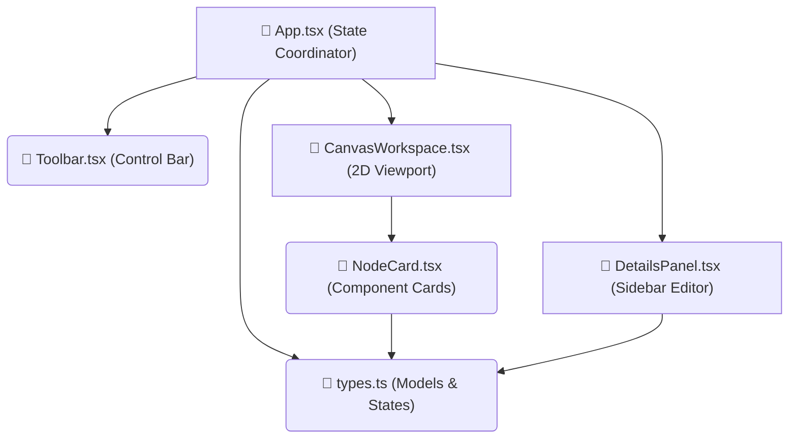

# 🌐 ArchCanvas — Interactive Codebase Map Maker

<div align="left">
  
  
  
  
</div>

<br />

**ArchCanvas** is a browser-native visual workspace designed to map folder hierarchies, annotate files, draw module data flows, and generate styled documentation. Instead of maintaining static drawings, ArchCanvas connects directly to your codebase, letting you lay out structure visually and compile a clean `.github/ARCHITECTURE.md` file (complete with interactive Mermaid diagrams) for your repository. <br> <hr>
Check it out: <a href="https://x2dat.github.io/architecture-canvas/" target="_blank" rel="noopener noreferrer">https://x2dat.github.io/architecture-canvas/</a>

---

## ✨ Key Features

*   🚀 **API GitHub Import**: Paste any public GitHub repository link to fetch its files hierarchy recursively via the GitHub REST API.
*   📁 **Local Folder Access**: Select a folder directly from your local disk using the browser's native **File System Access API** (`showDirectoryPicker`) to map structures instantly.
*   🖱️ **Infinite Zoom & Pan Viewport**: Seamlessly explore large codebases with cursor-centered scroll zooming and mouse drag-panning across an 8000px coordinate grid.
*   🔀 **SVG Bezier Connectors**: Drag-and-drop linking anchors on the edges of folders/files cards to draw glowing vector curves indicating imports, dependencies, or data flows.
*   🏷️ **Architectural Layers**: Group elements into logical tiers (UI Components, Business Logic, API Routers, Database Models, Configuration Helpers) with custom color badges.
*   📝 **GFM & Mermaid Exporter**: Compile custom annotations, component descriptions, and connection states into standardized GitHub-Flavored Markdown.
*   Toggleable Sidebar: Hide the project overview/editor sidebar at the click of a button to maximize drawing space, or click any component node to slide it back open.

---

## 🛠️ Architecture Canvas Structure

Here is how the **ArchCanvas** codebase is structured and coordinates data flows (generated using the app's own compiler output!):



---

## 💻 Tech Stack & Design

*   **Build Engine**: Vite + React 19 + TypeScript
*   **Styling**: Pure CSS with custom variable theme maps (sleek glassmorphic dark mode).
*   **Icons**: Lucide React
*   **Accessibility & SEO**: Clean semantics, proper layout hierarchies, and a single `<h1>` page heading.
*   **Module Syntax**: Strict compliance with TypeScript type-only imports (`import type`).

---

## 🚀 Getting Started

### Prerequisites

Ensure you have [Node.js](https://nodejs.org/) installed on your machine.

### Installation

1. Clone or navigate to the project directory:
   ```bash
<<<<<<< HEAD
   cd architecture-canvas
=======
   cd ArchCanvas
>>>>>>> 9a5526252a704746b0865ff219d50728a7c73b22
   ```

2. Install dependencies:
   ```bash
   npm install
   ```

3. Run the development server:
   ```bash
   npm run dev
   ```

4. Build the application for production:
   ```bash
   npm run build
   ```

---

## 📝 Documenting Your First Codebase

1.  Launch the app and click **Load Local Folder** (on supported browsers like Chrome/Edge) or paste a public GitHub URL in the **Import** input.
2.  Your folders and files will arrange themselves into an initial cascading directory grid.
3.  Hover over any card to reveal its left (input) and right (output) socket anchors.
4.  Drag a line from a card's **Right Anchor** to link it to another card, mapping out import rules or data flows.
5.  Click a card to select it, open the editor panel on the right, assign its **Architectural Layer**, and describe its purpose.
6.  Once you're done, click **Generate Doc File** in the panel to copy a formatted markdown template with directory breakdown, metrics tables, and Mermaid flow diagrams to create your `.github/ARCHITECTURE.md` file!
